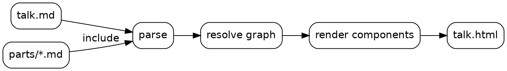

# Getting started with Lattice {#welcome layout=title}

Markdown in, a non-linear deck out.

::: notes
Press `p` to open this presenter view in another window. Both windows stay in sync.
:::

# Every `#` heading is a slide {#markdown}

{.reveal}
- Level-2 headings and below stay inside the slide
- An attribute block after the title sets the id, classes and edges
- A lone `#` makes an untitled slide
- Fragments like these appear one step at a time

::: notes
The next slide has no title at all: it was written as a bare `#`.
:::

#

::: callout 
This slide has no title. Its id is generated from the file name: `talk-3`.
:::

Everything you know from Markdown still works: **bold**, *emphasis*, `inline code`,
[regular links](https://commonmark.org), tables and math such as $O(n \log n)$.

| Structure | Lookup | Insert |
|---|---|---|
| Sorted array | $O(\log n)$ | $O(n)$ |
| Hash table | $O(1)$ average | $O(1)$ average |
| Balanced BST | $O(\log n)$ | $O(\log n)$ |

# Code, highlighted at build time {#code}

:::: columns
::: column {width=3fr}
```python {highlight=3-4 title="binary_search.py"}
def binary_search(xs, target):
    lo, hi = 0, len(xs)
    while lo < hi:
        mid = (lo + hi) // 2
        if xs[mid] < target:
            lo = mid + 1
        else:
            hi = mid
    return lo
```
:::
::: column {width=2fr}
Any language Pygments knows works: the fence info string is the language.

Use `highlight=` for static emphasis, or `code-steps` to walk through a file.
:::
::::

# Nothing here is linear {#the-graph}

A deck is a graph. Right follows the main path, but you can also:

{.reveal}
- enter a **detour** with Down (or its key) and come back automatically
- follow a link such as [[proof|the correctness proof]], then press Up to return
- press `o` for the overview or `g` to search for any slide

::: detour {#invariant-detour label="Why binary search terminates" key=w}
# The loop invariant

At every iteration, the answer lies in `[lo, hi]`, and `hi - lo` strictly decreases.

$$\text{answer} \in [lo, hi] \quad\wedge\quad hi - lo > 0 \implies \text{progress}$$

# Termination

Since `hi - lo` is a non-negative integer that decreases each iteration,
the loop runs at most $\lceil \log_2(n + 1) \rceil$ times.

The next press of Right returns to the slide you came from.
:::

::: notes
If someone asks why this works, press `w` for the invariant detour.
:::

# Diagrams from Graphviz {#diagram}



# Thanks {#thanks .center}

Questions? Press `g` and type a slide name.

# Proof of correctness {#proof offpath=true}

If `xs` is sorted, every index left of `lo` holds a value smaller than `target`
and every index from `hi` on holds a value at least `target`.

When the loop ends, `lo == hi`, so `lo` is the first index whose value is at least `target`.

This slide is **off path**: it is only reachable through a link, and Right returns to where you came from.
