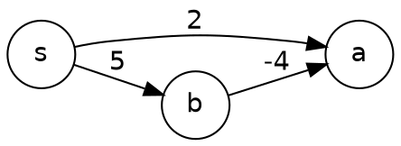

# Negative weights: Bellman-Ford {#bellman-ford}

Dijkstra finalizes a vertex when it is popped. A negative edge can later offer a shorter path.

Bellman-Ford relaxes every edge $V - 1$ times: $O(VE)$, and detects negative cycles.

# Why Dijkstra is correct {#dijkstra-proof}

**Invariant.** When $u$ is popped, $\text{dist}[u] = \delta(s, u)$.

Suppose not, and take the first such $u$. A shortest path to $u$ leaves the finalized set
through some edge $(x, y)$ with $y$ not finalized. Then
$\text{dist}[y] \le \delta(s, y) \le \delta(s, u) < \text{dist}[u]$,
so $y$ would have been popped before $u$. Contradiction.
