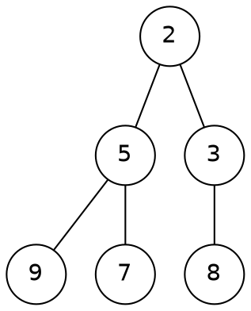

# What is a binary heap? {#heap-what}

A complete binary tree stored in an array, where every parent is at most its children.

:::: columns
::: column

:::
::: column
Children of index $i$ live at $2i + 1$ and $2i + 2$.

Parent of $i$ is at $\lfloor (i - 1) / 2 \rfloor$.
:::
::::

# Push: sift up {#heap-ops}

```array-anim {source="../algos.py:heap_push_trace" push=1}
values: [2, 5, 3, 9, 7, 8]
```

Each swap moves the new key one level up: at most $\log_2 n$ swaps.
