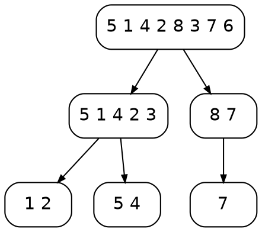

# Sorting, your way {layout=title}

A choose-your-own workshop: the audience picks the algorithm.

# Pick an algorithm {#pick}

Every option ends on the same comparison slide.

::: branch {layout=cards}
- [[bubble|Bubble sort]] swap neighbours until nothing moves
- [[insertion|Insertion sort]] grow a sorted prefix
- [[quick|Quicksort]] partition around a pivot
:::

::: notes
Let the room vote. Press 1, 2 or 3, or click a card.
:::

# Bubble sort {#bubble next=compare}

:::: columns
::: column {width=5fr}
```code {#src lang=python file="sorts.py" symbol=bubble_sort follow=bars}
```
:::
::: column {width=6fr}
```array-anim {#bars source="sorts.py:bubble_trace"}
values: [5, 1, 4, 2, 8, 3]
```
:::
::::

# Insertion sort {#insertion next=compare}

:::: columns
::: column {width=5fr}
```code {#src lang=python file="sorts.py" symbol=insertion_sort follow=bars}
```
:::
::: column {width=6fr}
```array-anim {#bars source="sorts.py:insertion_trace"}
values: [5, 1, 4, 2, 8, 3]
panel: [key]
```
:::
::::

# Quicksort {#quick next=compare}

{.reveal}
- Choose a pivot, partition, recurse on both sides
- Lomuto partition: one scan, pivot at the end

```array-anim {#bars source="sorts.py:quick_trace"}
values: [5, 1, 4, 2, 8, 3, 7, 6]
```

```timeline
reveal 1
reveal 2
bars 1..end
```

::: detour {label="The recursion tree" key=r}
# The recursion tree



Balanced splits give depth $\log_2 n$; a sorted input with a last-element pivot gives depth $n$.
:::

# How many comparisons? {#compare}

```plot {source="sorts.py:comparison_plot"}
```

Counted by instrumented versions of the three sorts on random inputs (seeded, so the chart is reproducible).

# Thanks {#done .center}

Press `o` to see the three paths through this deck.
