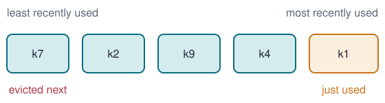

# Refactoring a cache {layout=title}

Three versions of an LRU cache, their diffs, and what the refactoring bought us.

# What an LRU cache keeps {#idea}



On a hit, the key moves to the right end. When full, the leftmost key is evicted.

::: notes
The image is embedded in the HTML at build time, like everything else.
:::

# A bug, fixed in place {#bug}

```code-morph {#fix lang=python file="versions/v0-bug.py" symbol=Cache.put label="v0: one item too many" title="put" highlight=changed}
steps:
  - full: "elif len(self.items) == self.capacity:"
    label: "fix: evict when full"
  - evict: "del self.items[self.order.pop(0)]"
    label: "two lines become one"
  - refresh: |
      self.items[key] = value
      self.order.remove(key)
      self.order.append(key)
      return
    label: "one line becomes four"
```

```arrow {follow=fix to_anchor=right length=90}
steps:
  - {to: full, label: "> lets the cache grow past capacity"}
  - {to: full, label: "== evicts before it grows"}
  - {to: evict, label: inlined}
  - {to: refresh, label: "an update needs no eviction"}
```

::: notes
The code is written once, in `versions/v0-bug.py`; each step replaces the text of one named segment. Tokens that survive glide to their new place.
:::

# From a list to an OrderedDict, then to statistics {#diff}

```diff-steps {lang=python context=3}
versions:
  - {file: versions/v1.py, label: "v1: dict + list"}
  - {file: versions/v2.py, label: "v2: OrderedDict"}
  - {file: versions/v3.py, label: "v3: hit and miss counters"}
```

::: notes
Step 1 is the original. Step 2 removes `order.remove(key)`, which is linear in the cache size.
:::

# Was it worth it? {#bench}

```plot {backend=vega data="data/bench.csv" x=capacity y=us_per_op group=version logx=true height=3.4}
xlabel: capacity (log scale)
ylabel: microseconds per operation
```

Hover the points for exact values. Measured on a Pareto-distributed key stream (20,000 operations).

# Hit rate by capacity {#hits}

```plot {backend=plotly data="data/bench.csv" x=capacity y=hit_rate group=version kind=bar height=3.8}
xlabel: capacity
ylabel: hit rate
```

Both versions evict the same keys, so their hit rates are identical: only the speed changed.

# Thanks {.center}

Build this deck as a folder with `lattice build talk.md --dir out`, then serve `out/`.
