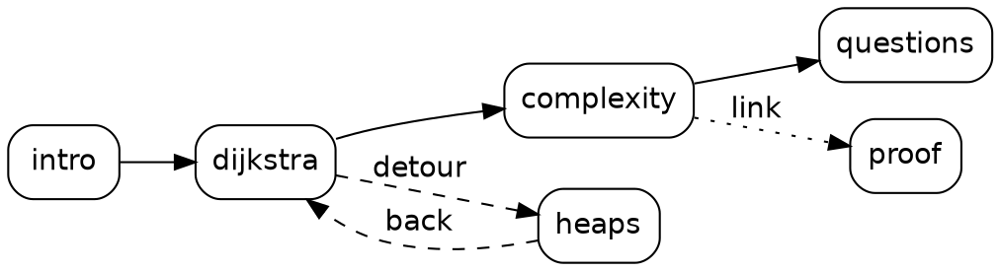
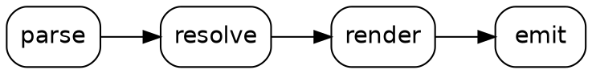

# Lattice User Manual {#lattice-user-manual layout=title}

Markdown in, a non-linear slide deck out. This manual is itself a Lattice deck: press `o` for its map, `g` to search it, `p` for the presenter view, and `t` to follow the short tour.

::: notes
This manual is built from `user_manual/manual.md`. Every feature it describes is used live on its slides, so reading the source next to the deck is the fastest way to learn the syntax.
:::

# What is a Lattice deck? {#what-is-a-deck}

{.reveal}
- One Markdown file (or several, with includes) compiled into **one self-contained HTML file** that works offline
- Slides form a **graph**: a main path, detours that return by themselves, branches where the audience picks, links to backup slides
- Content blocks can be **animations computed at build time**: graph, array, tree and grid traces run your own Python; compiler animations run a model of basic block versioning and abstract interpretation
- Plus highlighted code, plots, Graphviz diagrams, math, speaker notes, a presenter view and PDF export

::: callout 
A plain Markdown file with `#` headings is already a valid deck. Everything else is opt-in.
:::

# Install {#install}

```bash
pip install -e .              # core
pip install -e ".[plot]"      # + matplotlib for the plot component
pip install -e ".[pdf]"       # + playwright for PDF export (then: playwright install chromium)
pip install -e ".[dev]"       # + pytest, matplotlib, playwright
```

Python 3.10 or newer. The Graphviz `dot` program is used for `dot` diagrams, `.dot` graph files and the overview map; without it, animated graphs fall back to a NetworkX layout and the overview shows only an outline.

# The commands {#the-commands .dense}

| Command | What it does |
|---|---|
| `lattice new my-talk` | Scaffold `my-talk/talk.md` |
| `lattice serve talk.md [--host H] [--port P]` | Live preview with reload on save, at `http://127.0.0.1:8000` |
| `lattice build talk.md [-o out.html]` | Write the single-file deck next to the source |
| `lattice build talk.md --dir out` | Write `index.html`, `assets/` and `data/` instead (serve over HTTP) |
| `lattice check talk.md [--strict]` | Diagnostics only; exit code 1 on errors (`--strict`: on warnings too) |
| `lattice graph talk.md [--dot]` | Print the slide graph, or its Graphviz source |
| `lattice pdf talk.md [-o f.pdf] [--tour T] [--steps S] [--no-appendix]` | Export a tour to PDF |

Every command accepts `--no-cache`. Renders are cached in `.lattice-cache/` next to the root file, keyed by their inputs and the files they read.

# Front matter {#front-matter .dense}

| Key | Values | Meaning |
|---|---|---|
| `title`, `author`, `date` | strings | Deck metadata (the title defaults to the file name) |
| `theme` | `default`, `dark` | Built-in theme |
| `aspect` | `16:9`, `16:10`, `4:3` | Slide aspect ratio |
| `start` | a slide id | First slide (default: the first root slide that is not off path) |
| `tours` | `name: [ids]` or `name: main` | Named tours for the `t` key and `lattice pdf --tour` |
| `keys` | `action: key` or `action: [keys]` | Key binding overrides (see [[presenting-keys]]) |
| `transitions` | per edge kind: `slide`, `zoom`, `fade`, `none` | Transition when entering by a `next`, `branch`, `detour` or `link` edge |
| `plugins` | list of packages | Installed plugins to activate (see [[plugins]]) |
| `build.cache`, `build.output`, `build.frames.*` | bool; `single` or `dir`; ints | The render cache, the output mode, the keyframe thresholds |

Only the root file has front matter; every key is optional. Relative paths resolve against the file that mentions them.

# Several files: includes {#includes}

:::: columns
::: column {width=1fr}
```markdown
---
title: Shortest Paths
---

# Shortest Paths {layout=title}

::include{file="parts/intro.md"}
::include{file="parts/dijkstra.md"}

# Questions? {.center}

::include{file="parts/backup.md" offpath=true}
```
:::
::: column {width=1fr}
{.reveal}
- An include splices the slides of another file at that point and ends the current slide
- Allowed at the top level of a file or inside a detour; a part starts with a slide heading and has no front matter
- `offpath=true` marks every slide of the part as backup material
- A file is included at most once per deck (ids are global); cycles are errors
:::
::::

# Slides and ids {#slides-and-ids}

:::: columns
::: column {width=1fr}
```markdown
# Dijkstra's Algorithm
# Dijkstra's Algorithm {#dijkstra}
#
# {#overview .fullbleed}
```

| Heading | Id |
|---|---|
| `# Dijkstra's Algorithm` | `dijkstras-algorithm` |
| `#` (3rd slide of `talk.md`) | `talk-3` |
| a detour in slide `x` | `x-detour-1` |
:::
::: column {width=1fr}
{.reveal}
- A level-1 `#` heading is the only slide boundary; `##` and below stay inside the slide
- A bare `#` makes an untitled slide, with or without attributes
- Auto ids: lowercase the title, drop apostrophes and accents, turn other runs of characters into `-`
- Ids are global across files and shared with detours; a colliding auto id gets a `-2` suffix (warning LT008)
:::
::::

# Slide attributes {#slide-attributes .dense}

```markdown
# Bubble sort {#bubble .small next=compare layout=default transition=fade pdf="0,3,end"}
```

| Attribute | Meaning |
|---|---|
| `#id`, `.class` | The id, and CSS classes on the slide element |
| `next=id`, `next=back`, `next=none` | Explicit successor, "return from the current excursion", or a dead end |
| `offpath=true` | Backup slide: never an implicit successor, and Right returns from it |
| `layout=title` | Built-in layouts: `default`, `title` (big centered title) |
| `transition=fade` | Transition used when entering this slide |
| `pdf="first\|last\|all\|0,3,end"` | Steps printed by `lattice pdf`, numbered from 0 like the URL |

The built-in themes also style `.center`, `.fullbleed` (no padding) and `.small` (smaller text). Any other class is kept for your own CSS (this slide uses the manual's `.dense`); any other attribute becomes a `data-*` attribute, with warning LT010.

# Text and math {#text-and-math}

:::: columns
::: column {width=1fr}
CommonMark plus GFM tables and ~~strikethrough~~, inline math $O(n \log n)$ and display math:

$$\sum_{i=1}^{n} i = \frac{n(n+1)}{2}$$

| Structure | Lookup |
|---|---|
| Hash table | $O(1)$ |
| Balanced tree | $O(\log n)$ |
:::
::: column {width=1fr}
```markdown
Tables and ~~strikethrough~~, inline
math $O(n \log n)$ and display math:

$$\sum_{i=1}^{n} i = \frac{n(n+1)}{2}$$
```

::: callout 
KaTeX and its fonts are embedded only in decks that use math.
:::
:::
::::

# Images and code {#images-and-code}

:::: columns
::: column {width=1fr}
```markdown

```

Images are embedded as data URIs at build time; a missing image is warning LT051.
:::
::: column {width=1fr}
```python {highlight=2}
def mean(xs):
    return sum(xs) / len(xs)
```

Code fences are highlighted by Pygments, for any language it knows. An unknown fence name is rendered as plain text, with warning LT020.
:::
::::

# Fragments: reveal step by step {#fragments .dense}

:::: columns
::: column {width=1fr}
```markdown
{.reveal}
- Greedy choice
- Priority queue
  {.reveal}
  - binary heap
  - Fibonacci heap
- No negative weights

{.reveal}
A paragraph, revealed as one block.

{.reveal-with}
A remark, on the same step.
```
:::
::: column {width=1fr}
{.reveal}
- An attribute line `{.reveal}` directly before a block makes it revealable
- A list reveals one top-level item per step; any other block is one fragment
- Fragments are numbered across the slide and form its **reveal track**
- A `{.reveal}` line after an item's text reveals its nested list
  {.reveal}
  - item by item
  - in document order
- Hidden fragments keep their space, so nothing jumps

{.reveal-with}
`{.reveal-with}` brought this line with the last bullet: the block shares the previous fragment's step.
:::
::::

# Containers: columns, callouts, your own {#containers .dense}

::: columns
::: column {width=1fr}
```markdown
::: columns
::: column {width=2fr}
left
:::
::: column {width=1fr}
right
:::
:::

::: callout 
Mind the closing fences.
:::

::: aside
A styling hook: <div class="aside">
:::
```
:::
::: column {width=1fr}
- `columns` holds `column` containers; `width` is a fraction (`2fr`), a CSS length or `0`, `gap` spaces them; a timeline can change widths: [[columns-room]]
- `callout` with `kind` `info`, `tip` or `warn`
- `notes`, `detour` and `branch` have their own slides
- Any other name becomes `<div class="NAME">` for your CSS (warning LT019 near a built-in name)

::: callout 
Containers nest with `:::` at every level: a bare `:::` closes the innermost open one. The colons are not counted, so `::::` around `:::` still works.
:::
:::
:::

::: detour {#fences-demo label="Closing fences" key=f}
# Closing fences {#closing-fences .dense}

::: columns
::: column {width=1fr}
````markdown
::: detour {#more key=m}
# Inside the detour

::: columns
::: column
```markdown
::: callout
quoted, closes nothing
:::
```
::: /column
::: column
right
:::
::: /columns

# Its second slide
::::: /detour
````
::: /column
::: column {width=1fr}
{.reveal}
- `::: /NAME` closes the innermost container, like a bare `:::`, and checks that it is a `NAME`: error LT061 otherwise
- Named and bare fences mix freely, with any number of colons; name the fences that close long containers, such as detours
- Fences inside code blocks are skipped, so a slide can quote container syntax
- A closing fence with nothing to close is error LT061; a container left open at the end of its file is warning LT062

This slide closes its own columns with `::: /column` and `::: /columns`, and its detour with `::: /detour`.
::: /column
::: /columns
::: /detour

# Links and notes {#links-and-notes}

::::: columns
:::: column {width=1fr}
```markdown
See [[proof]] or [[proof|the correctness proof]].

::: notes
Ask the room first. If someone asks about
negative weights, go to [[bellman-ford]].
:::
```
::::
:::: column {width=1fr}
{.reveal}
- `[[id]]` links to a slide or a detour (its entry slide); the default label is the target's title
- Following a link is an excursion: Up (or Backspace) comes back to where you were
- Notes go to the presenter view only; links in notes are clickable there
- Write `\[[` for literal brackets; links are not recognized in code
::::
:::::

# The graph: main path and `next` {#the-graph}

:::: columns
::: column {width=1fr}


The **main path** follows `next` from the start slide and must not loop. `lattice graph` prints every edge.
:::
::: column {width=1fr}
Every slide has at most one `next` edge. Without a `next=` attribute it is, in this order:

{.reveal}
- none if the slide has a branch (the presenter chooses)
- `back` if the slide is off path
- the next slide of the same scope (root, or the enclosing detour) that is not off path
- else none in the root scope, `back` in a detour
:::
::::

# Detours {#detours}

::::: columns
:::: column {width=1fr}
```markdown
# Complexity

::: detour {#heaps label="Refresher: heaps" key=h}
# What is a binary heap?
...
# Push: sift up
...
:::
```
::::
:::: column {width=1fr}
{.reveal}
- A detour holds slides of its own, written inside the slide that offers it (its **origin**)
- Enter it with Down, its `key`, its badge or a link; its last slide returns to the origin by itself
- `label` defaults to the entry slide's title; `badge=false` hides the badge, `badge=next` waits for its detour step
- Detours nest, may contain includes, and their slides belong to the detour's scope
::::
:::::

::: detour {#detour-demo label="A detour, live" key=d}
# You are inside a detour {#inside-a-detour}

This slide belongs to the detour declared on the previous slide. Press Right: the detour ends and you return to its origin, at the step you left.

Up (or Backspace) returns at any time.
:::

# Branches {#branches}

::::: columns
:::: column {width=1fr}
```markdown
::: branch {layout=cards}
- [[bubble|Bubble sort]] swap neighbours
- [[insertion|Insertion sort]] {key=i}
- [[quick]]
:::
```

::: branch
- [[branch-target|Try an option]] it lands on the next slide
:::
::::
:::: column {width=1fr}
{.reveal}
- One bullet list of links; text after a link is its description, `{key=...}` picks the key (digits 1 to 9 by default)
- A branch slide has no `next`: the presenter chooses, with a key or a click
- `layout=cards` draws cards instead of a menu
- Targets must be in the same scope; give them `next=` to converge again
::::
:::::

# Where the option landed {#branch-target}

A branch choice is a forward move: Left goes back to the branch slide. One branch per slide, and its keys must be unique on the slide.

Off-path slides, tours and the overview complete the picture, next.

# Backup slides, tours and the map {#backup-and-tours}

:::: columns
::: column {width=1fr}
```markdown
---
tours:
  short: [intro, dijkstra, questions]
  full: main
---

# Proof {#proof offpath=true}
```

Unreachable slides are warning LT015; the deck still builds.
:::
::: column {width=1fr}
{.reveal}
- An **off-path** slide is left out of implicit `next` chains: reach it by a link, `g` or the overview, and Right returns from it
- A **tour** is a named list of ids (a detour id expands to its slides); `main` is the main path; `t` cycles through tours, and a tour's successor replaces `next`
- `o` opens the **overview**: a map of the graph plus an outline; click a slide to jump
- `g` searches slides by title or id
:::
::::

# Steps and tracks {#steps-and-tracks}

:::: columns
::: column {width=1fr}
{.reveal}
- A slide's **steps** are rows of a table; each column is a **track**: the reveal track (fragments) and one track per component with several positions
- With one track, Right simply advances it; a static slide has one step
- A `follow=LEADER` block is a **follower**: it copies its leader's position (a code block highlighting the lines of an animation frame)
- Two or more independent tracks need a `timeline` block (error LT023)
:::
::: column {width=1fr}
````markdown
```code {#code file="algos.py"
       symbol=dijkstra follow=trace}
```

```graph-anim {#trace
     source="algos.py:dijkstra_trace"}
graph: data/city.dot
```
````

A leader needs an `#id`; blocks without one are named `c1`, `c2`, ...
:::
::::

# Timelines {#timelines}

:::: columns
::: column {width=1fr}
````markdown
```timeline
reveal 2          # first two bullets
trace 1..end      # one step per frame
code 2, trace 5   # two tracks, one step
detour heaps      # a detour step
reveal +1         # relative move
```
````
:::
::: column {width=1fr}
{.reveal}
- One line per step (several for a range `a..b`); a line sets the tracks it names, the others keep their position
- Positions: absolute `3`, relative `+1` or `-1`, `end` or `end-2`; `#` starts a comment
- A `detour ID` line is a **detour step**: Right enters that detour there and, after the return, continues the slide; `blocking` also stops the skip keys
- Without a timeline, `at=2` on a detour inserts a detour step after step 2
:::
::::

# Timeline ranges {#timeline-ranges .dense}

:::: columns
::: column {width=1fr}
````markdown
```timeline
reveal 1                # the first bullet
sort ..+2               # two frames, two steps
reveal ..3, sort ..+2   # together
sort ..end-1 by 2       # every other frame
reveal ..end, sort end
```
````

```array-anim {#sort source="traces.py:bubble_trace"}
values: [3, 1, 2]
```
:::
::: column {width=1fr}
{.reveal}
- `..STOP` starts where the track is: `reveal ..end` reveals the remaining fragments, one per step
- `..+2` plays the next two positions in two steps, where `+2` jumps them in one
- Ranges on one line advance together and must have the same length (LT031)
- `end-1` counts from the last position; `by 2` keeps every other position and always ends on the stop
- An empty open range is warning LT030; `2..+3` is ambiguous, error LT049

```timeline
reveal 1
sort ..+2
reveal ..3, sort ..+2
sort ..end-1 by 2
reveal ..end, sort end
```
:::
::::

# Columns that make room {#columns-room}

:::: columns
::: column {#vsum-src}
```code-morph {#vsum lang=scheme file="programs/vsum.scm" lines=2-7 label="as written"}
steps:
  - ref: "(##vector-ref v i)"
    next: "(##fx+ i 1)"
    label: "checks removed"
```
:::
::: column {#vsum-ai width=0}
```abstract-interp-anim {#ai program="programs/vsum.bbv" direction=LR height=270}
panel: [worklist]
```
:::
::::

```arrow {#vsum-arrow to=ref to_anchor=right length=70 label="the access" color=detour}
```

```timeline
width vsum-src=0 vsum-ai=1fr   # the source makes room for the analysis
ai ..end
width vsum-src=1fr vsum-ai=0   # and comes back
vsum 1
```

The analysis needs the whole row: a `width` step collapses the source column, and another brings it back for the optimised code.

::: detour {#columns-room-syntax label="How it is written" key=w}
# How columns make room {#columns-room-how .dense}

:::: columns
::: column {width=1fr}
````markdown
::: columns
::: column {#src}
```code-morph {#code ...}
```
:::
::: column {#viz width=0}
```abstract-interp-anim {#ai ...}
```
:::
:::

```timeline
width src=0 viz=1fr   # src collapses
ai ..end
width src=1fr viz=0   # src comes back
code 1
```
````
:::
::: column {width=1fr}
- `width COL=W ...` gives the named columns a new width from that step on; the others keep theirs
- `W` is a fraction (`2fr`), a CSS length or `0`; `width=0` on a column collapses it from the start
- A collapsed column takes no room and gives back its gap; it is hidden, and what it holds keeps stepping
- The contents take their final width at once and the columns slide for `duration` ms (`::: columns {duration=600}`); arrows follow
- Left, jumps, the scrubber and print place the widths of the step directly
:::
::::
:::

# Badges that wait for their turn {#badge-steps .dense}

::::: columns
:::: column {width=1fr}
````markdown
{.reveal}
```python
def fib(n): ...
```

::: detour {#slow at=1 badge=next key=s}
# Why is it slow?
:::

::: detour {#memo at=1 badge=step key=m}
# Memoize it
:::
````
::::
:::: column {width=1fr}
{.reveal}
```python
def fib(n):
    return n if n < 2 else fib(n - 1) + fib(n - 2)
```

Right shows the code; the next two steps enter `slow`, then `memo`. A badge with `badge=next` appears only when Right is about to enter its detour, one with `badge=step` stays from then on. Both need a detour step (else LT055); a hidden badge's key still works.
::::
:::::

::: detour {#slow at=1 badge=next key=s}
# Why is it slow? {#why-slow}

Each call makes two more, so `fib(n)` makes about $1.6^n$ calls: `fib(30)` alone makes 2.7 million.

Press Right to return to the slide: the badge of `slow` is gone, the one of `memo` has appeared.
:::

::: detour {#memo at=1 badge=step key=m}
# Memoize it {#memoize-it}

```python
from functools import cache

@cache
def fib(n):
    return n if n < 2 else fib(n - 1) + fib(n - 2)
```

Each value is computed once: about $2n$ calls instead of $1.6^n$. Press Right to return; the badge of `memo` stays, since it uses `badge=step`.
:::

# Badges where you want them {#placed-badges .dense}

::::: columns
:::: column {width=1fr}
````markdown
::: column
{.reveal}
`::detour-badge{ref=ID}` draws ...

::detour-badge{ref=inherits label="Inherited?"}
:::

::: detour {#inherits at=1 badge=step key=n}
# What a placed badge inherits
...
:::
````

::detour-badge{ref=inside}
::::
:::: column {width=1fr}
{.reveal}
`::detour-badge{ref=ID}` draws a badge of the detour `ID` where it stands: in a column, a callout or a list item. The detour stays at the top level of the slide and needs an `#id`; once placed, its badge no longer appears where the detour is written. A detour may have several badges.

::detour-badge{ref=inherits label="Inherited?"}
::::
:::::

::: detour {#inside label="Why not a detour inside the column?" at=1 badge=step key=i}
# Why not a detour inside the column? {#why-not-inside}

- A detour's slides would sit in the middle of the column, far from the rest of the slide's text
- The column would hold whole slides, headings and all, and its closing fence would sit after the last of them
- So the detour stays at the top level and only its badge moves: the slide's source stays readable
:::

::: detour {#inherits label="What does a placed badge inherit?" at=1 badge=step key=n}
# What a placed badge inherits {#badge-inheritance}

| Attribute | On a placed badge |
|---|---|
| `label` | inherited; `label=` overrides it |
| `badge` (`true`, `step`, `next`) | inherited; `badge=` overrides it, so one detour can have a `next` badge here and a `step` badge there |
| `key`, `at`, `blocking` | the detour's, not settable: the key shows on every badge, and the detour step belongs to the detour |
| `#id`, classes | the badge's own |

A placed badge with no detour to name, or one that breaks these rules, is error LT056.
:::

# Components {#pick-a-component}

A fenced block whose name is a registered component renders it; any other name is a code language. Pick a family with its key or a click; from there, Right walks through the families that follow it.

::: branch {layout=cards}
- [[code-blocks|Code]] {key=c} code, code-steps, diff-steps
- [[plots|Plots and diagrams]] {key=l} plot, dot, math, arrow, then code segments and code-morph
- [[graph-anim|Animations]] {key=a} graph, array, tree, grid
- [[compiler-animations|Compiler animations]] {key=v} bbv-anim, bbv-cfg, abstract-interp-anim
:::

# Code {#code-blocks .dense}

:::: columns
::: column {width=2fr}
```code {lang=python file="search.py" symbol=binary_search highlight=7-8 linenos=true line_base=file title="search.py"}
```

````markdown
```python {highlight=2-3 title="x.py"}
inline code
```

```code {lang=python file="search.py"
       symbol=binary_search linenos=true}
```
````
:::
::: column {width=3fr}
| Option | Meaning |
|---|---|
| `lang` | Pygments language (a fence named after a language sets it) |
| `file`, `lines=4-9`, `symbol=f` | Read a file, a line range, or a Python function or class |
| `highlight=2-3,7` | Emphasized lines (or segments, see later) |
| `linenos`, `line_base=file` | Line numbers, counted in the file rather than the snippet |
| `title` | A caption bar |
| `file="lattice:bbv/pseudocode/sbbv.txt"` | A file bundled with Lattice |
| `follow=trace`, `meta=algo` | Highlight the lines an animation names in each frame |
:::
::::

# Code steps and diffs {#code-steps}

:::: columns
::: column {width=1fr}
```code-steps {#walk file="search.py" lang=python lines=4-12 linenos=true line_base=file}
steps:
  - 4-5     # the invariant
  - 6-10    # halve the interval
  - 11      # the answer
```
:::
::: column {width=1fr}
```diff-steps {#diff lang=python context=2}
versions:
  - {file: versions/v1.py, label: "v1: a loop"}
  - {file: versions/v2.py, label: "v2: sum, and an empty check"}
```

`code-steps` highlights one range per step. `diff-steps` steps through versions of a file (`file` or inline `code`, with a `label`); `context` keeps that many lines around each change.
:::
::::

```timeline
walk 1..end       # the code steps first
diff 1..end       # then the versions
```

# Plots {#plots}

:::: columns
::: column {width=1fr}
```plot {data="data/bench.csv" x=n y=ms group=algorithm logy=true height=3.2}
xlabel: elements
ylabel: time (ms)
```

````markdown
```plot {data="data/bench.csv" x=n y=ms
         group=algorithm logy=true}
```
````
:::
::: column {width=1fr}
{.reveal}
- `data` is a CSV; `x`, `y` (a column or a list) and `group` pick the series
- `kind` is `line`, `bar` or `scatter`; `xlabel`, `ylabel`, `title`, `logx`, `logy`, `legend`, `width` and `height` (inches)
- `backend=matplotlib` (default) embeds an SVG; `vega` and `plotly` embed an interactive chart and ship the library only in decks that use it (Plotly adds about 4.4 MB)
:::
::::

# Plot sources and raw specs {#plot-sources}

:::: columns
::: column {width=1fr}
```plot {source="traces.py:running_times" height=3.4}
```

```python
def running_times(ax):
    ax.plot(sizes, ..., label="n log n")
    ax.legend()
```
:::
::: column {width=1fr}
```plot {backend=vega data="data/bench.csv" x=n y=ms group=algorithm logx=true logy=true height=3.4}
xlabel: elements
ylabel: time (ms)
```

`source="file.py:fn"` draws with your code: a function taking `ax` (and `data`) for matplotlib, or returning a Vega-Lite spec or a Plotly figure. A `spec:` body passes a raw spec; theme colours are merged in, yours win.
:::
::::

# Diagrams, math and arrows {#dot-and-math}

:::: columns
::: column {width=1fr}


A `dot` block is laid out by Graphviz at build time (`engine` picks `dot`, `neato`, `fdp`, `circo`, `twopi` or `sfdp`) and takes the theme's colours.
:::
::: column {width=1fr}
```math
d(v) = \min_{(u, v) \in E} \big(d(u) + w(u, v)\big)
```

A `math` block is display math, like `$$...$$`.

{#arrow-target}
An `arrow` block points at any element of the slide, here at this paragraph.
:::
::::

```arrow {to=arrow-target label="from the lower right, the default" angle=315 length=140}
```

# Arrows that move {#arrows}

:::: columns
::: column {width=1fr}
```code {#arrow-code lang=python file="search.py" symbol=binary_search linenos=true}
```
:::
::: column {width=1fr}
````markdown
```arrow {color=detour curve=0.2}
steps:
  - to: .lt-line[data-line="3"]
    label: the loop
  - to: .lt-line[data-line="4"]
    from: arrow-code-note
```
````

{#arrow-code-note}
`to` and `from` name an element id, an item of a list (`facts[2]`, next slides) or a CSS selector. `angle` is measured from the target toward the tail (0 right, 90 above, 315 lower right), `length` in slide pixels; `curve` bends, `color` is a CSS colour or a theme token (`accent`, `detour`, `muted`, `ink`). With `steps:` the arrow is a track, gliding from target to target; a `null` step shows no arrow.
:::
::::

```arrow {#arrow-walk color=detour curve=0.2}
steps:
  - to: .lt-line[data-line="3"]
    label: the loop
  - to: .lt-line[data-line="4"]
    label: the midpoint
  - to: .lt-line[data-line="9"]
    from: arrow-code-note
    label: ""
```

# Named code segments {#code-segments .dense}

:::: columns
::: column {width=1fr}
```code-steps {#seg-walk lang=scheme file="programs/sum-to-n.scm" lines=2-9}
steps: [i-init, body]
```

````scheme {markers=false title="programs/sum-to-n.scm"}
  (let loop (#|@i-init|# (i 0) #|@end|#
             (acc 0))
    #|@body|#
    (if (> i n) ...)
    #|@end|#))
````
:::
::: column {width=1fr}
{#seg-note}
A comment holding only `@name` opens a segment, `@end` closes it:

- inline, in `#| |#`, `/* */`, `(* *)`, `{- -}` or `<!-- -->`
- on a line of its own, `# @loop` (also `;`, `//`, `--`, `%`)

The markers vanish from the slide and the segment becomes an element id: `to: i-init` for an arrow, `highlight=i-init` or a `steps:` entry for a highlight. Line numbers still count the file as written; `markers=false` shows a block as written, as below on the left.
:::
::::

```arrow {#seg-arrow follow=seg-walk color=detour}
steps:
  - to: i-init
    to_anchor: bottom
    angle: 300
    label: "to: i-init"
  - to: i-init
    to_anchor: bottom
    angle: 300
    label: "steps: [i-init, ...]"
  - to: body
    to_anchor: right
    length: 70
    label: body
```

# Arrow anchors {#arrow-anchors .dense}

:::: columns
::: column {width=1fr}
```code {lang=scheme file="programs/sum-to-n.scm" lines=2-9}
```

````markdown
```arrow {to=i-init}
from: anchor-points[1]
from_anchor: left
to_anchor: bottom
```
````
:::
::: column {width=1fr}
{#anchor-points}
- The counter starts at zero
- The loop adds `i` until it passes `n`

`from_anchor` and `to_anchor` pick where the arrow leaves `from` and enters `to`: `left`, `right`, `top`, `bottom` (the middle of that side), `center`, or an angle in degrees (0 right, 90 top, counterclockwise). The curve leaves and enters along that direction.
:::
::::

```arrow {#anchor-walk from=anchor-points[1] from_anchor=left to_anchor=bottom}
steps:
  - i-init
  - to: body
    from: anchor-points[2]
    to_anchor: right
  - to: i-init
    from: ""
    to_anchor: 30
    label: "to_anchor: 30"
```

# Arrows at bullets {#arrow-bullets .dense}

:::: columns
::: column {width=1fr}
```code {lang=scheme file="programs/sum-to-n.scm" lines=2-9}
```

````markdown
```arrow {from_anchor=bullet to_anchor=right}
steps:
  - from: loop-facts[1]
    to: i-init
  - from: loop-facts[2]
    to: bound
  - from: loop-facts[2][1]
    to: body
  - from: loop-result[-1]
    to: bound
```
````
:::
::: column {width=1fr}
{#loop-facts}
- `i` starts at zero
- the loop stops once `i` passes `n`
  - so `acc` sums `0` to `n`

{#loop-result}
1. `n + 2` tests when `n` ≥ 0
2. one test, and `0`, when `n` is negative

`LIST[N]` is item `N` of the list with id `LIST`, from 1 (`[-1]` is the last); `loop-facts[2][1]` descends into the list nested in item 2. An arrow at an item points at its own lines, without its nested list. `bullet` puts an end at the item's marker, leaving or entering to the left. The build checks both (error LT063).
:::
::::

```arrow {#bullet-walk color=detour curve=-0.15 from_anchor=bullet to_anchor=right}
steps:
  - from: loop-facts[1]
    to: i-init
  - from: loop-facts[2]
    to: bound
  - from: loop-facts[2][1]
    to: body
  - from: loop-result[-1]
    to: bound
  - to: loop-result[1]
    to_anchor: bullet
    length: 40
```

# Code that changes {#code-morph .dense}

:::: columns
::: column {width=1fr}
```code-morph {#mean lang=python title="mean" linenos=true}
versions:
  - {file: versions/v1.py, label: "v1: a loop"}
  - code: |
      def mean(xs):
          if not xs:
              raise ValueError("mean of an empty sequence")
          total = 0
          for x in xs:
              total += x
          return total / len(xs)
    label: "an empty check"
  - {file: versions/v2.py, label: "v2: sum"}
```

````markdown
```code-morph {#mean lang=python title="mean"}
versions:
  - {file: versions/v1.py, label: "v1: a loop"}
  - {code: "...", label: "an empty check"}
  - {file: versions/v2.py, label: "v2: sum"}
```
````
:::
::: column {width=1fr}
The text changes in place: tokens that survive glide to their new place, the others fade out or in. `versions:` is read as by `diff-steps`.

| Option | Meaning |
|---|---|
| `room=fit` | Height of the current version (default `max`: the tallest, nothing below moves) |
| `duration=900` | Milliseconds of one step (default 600) |
| `mark=true` | Tint arriving tokens for a moment |
| `linenos`, `title` | Numbers for the rows shown; a caption bar with the version's label |
| `lang` in a version | That version in another language |
| `highlight` | Lines and segments to highlight: [[morph-highlights]] |
:::
::::

# Morphing named segments {#morph-segments .dense}

:::: columns
::: column {width=1fr}
```code-morph {#loop lang=scheme file="programs/sum-to-n.scm" lines=2-9 label="as written" mark=true}
steps:
  - bound: "(>= i n)"
    label: "stop before n"
  - i-init: "(i 1)"
    label: "start at 1"
```

```code-morph {#tr lang=python}
versions:
  - code: |
      def total(xs):
          return sum(xs)
  - code: |
      (define (total xs)
        (apply + xs))
    lang: scheme
```
:::
::: column {width=1fr}
````markdown
```code-morph {#loop lang=scheme
     file="programs/sum-to-n.scm"}
steps:
  - bound: "(>= i n)"
    label: "stop before n"
  - i-init: "(i 1)"
```
````

{.reveal}
- The file is written once; each step replaces the text of named segments, and steps add up
- An arrow at `bound` follows the segment as its text changes
- A version with its own `lang` turns the code into another language
:::
::::

```arrow {#morph-arrow to=bound to_anchor=right length=70 label=bound color=detour}
```

```timeline
loop 1, reveal 1
loop 2, reveal 2
tr 1, reveal 3
```

# Highlights in a morph {#morph-highlights .dense}

:::: columns
::: column {width=1fr}
```code-morph {#hlm lang=scheme file="programs/sum-to-n.scm" lines=2-9 linenos=true highlight=changed}
steps:
  - bound: "(>= i n)"
  - i-init: "(i 1)"
    highlight: "bound, i-init"
  - bound: null
    i-init: null
    highlight: ""
```

````markdown
```code-morph {#hlm lang=scheme
     file="programs/sum-to-n.scm"
     highlight=changed}
steps:
  - bound: "(>= i n)"
  - i-init: "(i 1)"
    highlight: "bound, i-init"
  - {bound: null, i-init: null,
     highlight: ""}
```
````
:::
::: column {width=1fr}
- `highlight` takes lines and segment names, as in a `code` block; the rows around them are dimmed
- In a version or a step it holds for that position only; the option is the default of every position
- `changed` lights the rows where new tokens arrived; `highlight: ""` turns it off for one position
- Line numbers count the rows of the version shown; highlights fade with the tokens
:::
::::

# Graph animations {#graph-anim}

:::: columns
::: column {width=6fr}
```code {#bfs-code lang=python file="traces.py" lines=11-26 follow=bfs}
```
:::
::: column {width=5fr}
```graph-anim {#bfs source="traces.py:bfs_trace" graph="data/city.dot" start=A height=250}
panel: [queue]
edge_labels: false
```
:::
::::

````markdown
```graph-anim {#bfs source="traces.py:bfs_trace" graph="data/city.dot" start=A height=250}
panel: [queue]
edge_labels: false
```
````

# Graph animation options {#graph-anim-options .dense}

| Option | Meaning |
|---|---|
| `source="file.py:fn"` | The trace function; it receives the graph, then every other option as a keyword (`start=A` above) |
| `graph="g.dot"`, `edges: ["A B 4", "B C 1"]` | The graph: a `.dot`, `.gml` or node-link `.json` file, or inline weighted edges |
| `directed`, `engine`, `rankdir` | Arrowheads; Graphviz engine (`auto` is `dot`, left to right) and rank direction |
| `edge_labels` | Show edge weights (on by default when the graph has them) |
| `panel: [dist, queue]` | Which panel entries of the frames to show, in that order |
| `height` | Height of the drawing in slide pixels |

The layout is computed once over every node and edge of every frame, so nothing moves between frames. The code beside the animation follows it through `follow=bfs`: each frame names the line it executes in its `meta`.

# Array animations {#array-anim}

:::: columns
::: column {width=1fr}
```array-anim {#bubble source="traces.py:bubble_trace"}
values: [5, 2, 4, 1, 3]
```
:::
::: column {width=1fr}
````markdown
```array-anim {#bubble
     source="traces.py:bubble_trace"}
values: [5, 2, 4, 1, 3]
```
````

`values` is passed to the trace function, as is any other option. Frames carry `values`, persistent `cells` states, per-frame `marks`, named `pointers`, a `caption` and a `panel`.
:::
::::

# Tree animations {#tree-anim}

:::: columns
::: column {width=1fr}
```tree-anim {#bst source="traces.py:bst_trace" height=300}
values: [8, 3, 10, 1, 6, 14, 4]
```
:::
::: column {width=1fr}
````markdown
```tree-anim {#bst source="traces.py:bst_trace"
     layout=auto height=300}
values: [8, 3, 10, 1, 6, 14, 4]
```
````

- A `TreeTrace` snapshots your own node objects (`t.frame(root=root)`), so the lab's implementation is traced as it is; tuples `("y", ("x", "T1", "T2"), "T3")` work too
- `layout`: `binary` places nodes by in-order rank, `tidy` packs leaves; `auto` picks `binary` for binary trees
- Nodes glide to their new positions on single steps
:::
::::

# Grid animations {#grid-anim}

:::: columns
::: column {width=1fr}
```grid-anim {#lcs source="traces.py:lcs_trace" a=ABCB b=BDCAB height=330}
```
:::
::: column {width=1fr}
````markdown
```grid-anim {#lcs source="traces.py:lcs_trace"
     a=ABCB b=BDCAB height=330}
```
````

A `GridTrace(values, rows=, cols=)` holds a 2D grid with optional header labels. Frames change single cells with `put={(i, j): value}` or replace `values`; `cells` and `marks` colour them, `pointers` point at cells, `arrows` link them; `cell` sets the cell size (default 48).
:::
::::

# Writing a trace {#writing-traces .dense}

:::: columns
::: column {width=1fr}
```python
from lattice import GraphTrace

def bfs_trace(g, start="A"):
    t = GraphTrace(g)
    t.frame(nodes={start: {"state": "frontier", "label": 0}},
            panel={"queue": [start]}, caption="Start",
            meta={"line": 2})
    ...
    t.frame(nodes={u: "visited"}, edges={(u, v): "tree"})
    return t
```
:::
::: column {width=1fr}
{.reveal}
- `frame(delta=None, *, meta=None, transient=None, **parts)` appends one frame; `nodes=`, `edges=`, `panel=`, `caption=` are merged into the delta
- Frames are **deltas**: `None` removes a key, nested mappings merge, lists replace; the build expands them into full states
- A node or edge value is a state name, or a mapping with `state` and `label`; edges are `(u, v)` tuples
- `transient` applies to one frame; `meta` (such as `line` or `lines`) is for followers
:::
::::

# States the themes style {#states .dense}

| Trace | Element | States |
|---|---|---|
| `GraphTrace`, `TreeTrace` | nodes and edges | `active`, `frontier`, `visited`, `done`, `tree`, `path`, `dim`, `error` |
| `ArrayTrace` | cells | `compare`, `swap`, `pivot`, `sorted`, `done`, `dim` |
| `GridTrace` | cells | `active`, `compare`, `frontier`, `visited`, `done`, `path`, `wall`, `start`, `goal`, `dim`, `error` |
| `GridTrace` | arrows | `active`, `path`, `dim` |
| `VersioningTrace` | nodes | states `queued`, `done`; marks `active`, `new`, `back`, `merge`, `merged`, `gone` |
| `AbstractTrace` | nodes and edges | state `dead`; marks `changed`, `widened`; edge state `active` |

A frame may also carry a `panel` (names to scalars, lists or mappings, drawn beside the animation when the block's `panel:` option names them) and a `caption`. Very large animations are stored as keyframes plus deltas automatically.

# Compiler animations {#compiler-animations}

Three components run a build-time model of the techniques on a small program and record one frame per event of the algorithm:

{.reveal}
- `bbv-anim`: Static Basic Block Versioning, or Lambda Versioning with `algorithm=lv`; versions appear as they are queued and specialized, merge, become unreachable, and for ΛV entry points and return points come and go across functions
- `bbv-cfg`: the source CFG, as a static figure or following an animation to highlight the block being specialized
- `abstract-interp-anim`: the classical analysis on a fixed CFG, with intervals, widening at joins and narrowing at conditionals

Programs are written in a small CFG language, next.

# The program language {#bbv-language .dense}

:::: columns
::: column {width=1fr}
```code {lang=text file="programs/find.bbv" lines=2-9 title="programs/find.bbv"}
```
:::
::: column {width=1fr}
{.reveal}
- `function NAME(params)` then blocks: `LABEL:` and instructions; `;` starts a comment
- Instructions: `x = prim(args)`, `x = y`, `if TEST goto A else goto B`, `goto A(x=y)`, `call f(args) -> K`, `return x`, `fail`
- Tests are type tests (`pair?`, `fixnum?`, `vector?`, ...) or comparisons; `##car`, `##vector-length` and friends skip their checks
- `n: fx | bg` or `i: fx [0, ⟦v⟧-1]` annotates a parameter; a block's parameters are its live variables, or an explicit list
:::
::::

# SBBV, with the source CFG following {#bbv-anim}

:::: columns
::: column {width=1fr}
```bbv-cfg {#src program="programs/find.bbv" follow=trace height=400}
show: [label]
```
:::
::: column {width=3fr}
```bbv-anim {#trace program="programs/find.bbv" algorithm=sbbv limit=2 direction=LR height=400}
show: [label, context]
panel: [queue, checks]
```
:::
::::

# The versioning blocks {#bbv-blocks}

````markdown
```bbv-cfg {#src program="programs/find.bbv" follow=trace}
show: [label]
```

```bbv-anim {#trace program="programs/find.bbv" algorithm=sbbv limit=2 direction=LR}
show: [label, context]
panel: [queue, checks]
```
````

`show` picks what a node draws among `label`, `context` and `code` (the default is all three; `bbv-cfg` draws label and code). A queued version shows `…` in place of its code until it is specialized; removed tests are struck through.

# Enlarging a block {#bbv-zoom .dense}

:::: columns
::: column {width=2fr}
```bbv-cfg {#zcfg program="programs/find.bbv" height=380}
show: [label]
```
:::
::: column {width=3fr}
- Click a block of a versioning or abstract interpretation drawing (try the one on the left): it fills most of the slide, which blurs behind it
- It shows the block **at the current step** with everything it holds, even what `show` leaves out: label, context, code and exit context
- Any key, or a click outside it, closes it without moving
- In presenter view it opens over the slide pane, and in the audience window too
- `clickable=off` turns clicks off; `clickable_show: [label, code]` picks among `label`, `context`, `code` and `after` (the exit context)
:::
::::

# Versioning options {#bbv-options .dense}

| Option | Meaning |
|---|---|
| `program="f.bbv"`, `program="f.py:fn"`, `source:` | The program: a file, a Python function returning a `Program` or its text, or the text in the body |
| `algorithm`, `limit`, `limits: {f: 3, g: none}` | `sbbv` or `lv`; the version limit, overall or per function |
| `heuristic` | The merge heuristic: `similarity`, `arithmetic` or `random` |
| `entry`, `functions: [f, g]` | The function traversed first; the functions drawn, in that order (hidden ones are analysed, not drawn) |
| `events`, `granularity=instruction`, `until` | Event kinds kept as frames; a frame per instruction; stop after N frames |
| `panel: [queue, versions, checks, merges, limit]`, `caption=none` | Panel entries; no captions |
| `colors=none`, `direction=LR`, `wrap=4`, `call_edges`, `height`, `prims` | Fills off; block bands direction; versions per line; dotted call edges; drawing height; extra primitives (a predicate declared there can be tested in an `if`) |
| `intervals=true`, `thresholds`, `fixnum_bits=61`, `vector_bounds=false` | Track integer intervals and vector lengths (merges widen with the thresholds of the abstract interpreter); the fixnum width; lengths as numbers instead of `⟦v⟧` |
| `clickable=off`, `clickable_show` | No enlarging on click; what an enlarged block shows |

# Instruction by instruction, with the algorithm's listing {#bbv-instructions}

:::: columns
::: column {width=5fr}
```code {#algo lang=text file="lattice:bbv/pseudocode/sbbv.txt" lines=22-32 follow=inst meta=algo line_base=file linenos=true}
```
:::
::: column {width=4fr}
```bbv-anim {#inst program="programs/power4.bbv" algorithm=sbbv limit=2 entry=square granularity=instruction height=300}
functions: [square]
events: [start, dequeue, instruction, done]
```
:::
::::

A `code` block with `meta=algo` follows the lines of the bundled listing (`lattice:bbv/pseudocode/sbbv.txt`, `lv.txt` or `absint.txt`) that each event executes; with `follow=` alone it follows the program's own lines.

# Lambda versioning and abstract interpretation {#lv-and-absint}

:::: columns
::: column {width=1fr}
```bbv-anim {#lv program="programs/power4.bbv" algorithm=lv limit=3 entry=power4 wrap=3 until=24 height=250}
functions: [power4, square]
show: [label, context]
```
:::
::: column {width=1fr}
```abstract-interp-anim {#ai program="programs/fact-loop.bbv" height=250}
panel: [worklist]
```
:::
::::

```timeline
lv 1..end
ai 1..end
```

Left, `algorithm=lv`: entry points, exit sites and indexed return points (dashed edges) across two functions. Right, `abstract-interp-anim`: the CFG stays and the contexts change in place.

# Abstract interpretation options {#absint-options .dense}

````markdown
```abstract-interp-anim {#ai program="programs/sum-to-n.bbv" thresholds=machine}
panel: [worklist, history]
history: [B.i]
```
````

| Option | Meaning |
|---|---|
| `entry` | The function analysed (default: the first) |
| `thresholds` | `machine` (the sign and the 8, 32 and 64-bit limits), `sign`, `none` (plain union), or a list of integers and names (`[sign, maxfix]`: stop at the largest fixnum; `maxfix-1` too) |
| `narrowing=false` | Keep the outcomes of tests but learn nothing from them |
| `fixnum_bits` | Where an integer stops being a fixnum (default 61) |
| `history: [B.i]` | Variables whose chain of entry values the panel shows, with `∪` and `∇` steps |
| `panel: [worklist, iterations, history]` | Panel entries |
| `show`, `events`, `granularity`, `until`, `caption`, `height`, `clickable`, `clickable_show` | As for `bbv-anim`; events are `start`, `dequeue`, `instruction`, `propagate`, `done` |

# Intervals and vector lengths {#bbv-intervals .dense}

- `intervals=true` keeps the intervals of annotations, constants and arithmetic; comparisons narrow them, merges widen them (`thresholds`, `fixnum_bits`)
- `len = ##vector-length(x)` is `fx {⟦x⟧}`, the length of the vector held by `x` (type `vec`); a bound may be `⟦x⟧-1`, and it follows its vector through assignments, `goto` and calls
- `fx<(i, len)` bounds `i` by `⟦x⟧-1`: the checks guarding `vector-ref` and the overflow test of `fx+?` are decided and removed (paper figure 7)

```bbv-anim {#vec program="programs/findv.bbv" algorithm=sbbv limit=2 intervals=true direction=LR height=230}
show: [label, context]
```

# Reading the drawing {#reading-the-drawing .dense}

:::: columns
::: column {width=1fr}
- A node is a version: label (`A2`, starred for an entry point), `;;` context lines (variable, type, interval), code lines with removed tests struck through
- Fill: the origin block; border: the current mark (amber active, teal new, red merge candidate or widened, green merged result); dashed: queued
- Edges: `goto`, `#t` and `#f` branches, dashed `[i]` return edges, dotted call edges with `call_edges`
:::
::: column {width=1fr}
- The caption reads badge, versions, details: the operation (`SPECIALIZE`, `TEST REMOVED`, `MERGE`, `WIDEN`, ...), chips in the colour of the block, then contexts and effects
- The panel lists the queue or worklist as chips, counters as numbers, a widening chain as `∪` and `∇` steps
- Hover a node for its full context, code and exit context, or click it to enlarge it; `colors=none` turns the fills off
:::
::::

# Presenting: the keys {#presenting-keys .dense}

| Key | Action |
|---|---|
| Right, Space, PageDown | Next step, then next slide (`next`) |
| Left, PageUp | Undo the last move; with nothing to undo, the previous slide (`prev`) |
| Shift+Right, Shift+Left | Ten steps forward or back, played quickly; three in a second: all the way (`skip-forward`, `skip-back`) |
| End | Last step of the slide (`last-step`) |
| Down | Enter the slide's first detour (`enter-detour`) |
| Shift+Down | Step over the next detour step without entering it (`skip-detour`) |
| Up, Backspace | Return from the current detour or jump (`return`) |
| 1 to 9, the slide's keys | Choose a branch option or a detour (`choose`) |
| `o`, `g`, `p`, `t` | Overview, go to a slide, presenter view, next tour (`overview`, `goto`, `presenter`, `tour`) |
| Home | Back to the start, clearing the history (`home`) |
| Click a block | Enlarge a block of a versioning drawing; any key or a click outside closes it |

Rebind any action in the front matter, `keys: {next: [ArrowRight, n], presenter: P}`; a key is a `KeyboardEvent.key` name, optionally prefixed with `Shift+`.

# Left and Up: the history {#history}

{.reveal}
- Lattice keeps a **history** of moves. Left undoes the last one, like a browser's back button: after a branch choice it goes back to the branch slide
- Entering a detour, following a link, go-to and the overview are **excursions**: Up undoes the whole excursion at once and lands where it started, at the step you left
- A detour's last slide returns by itself, and so does a slide with `next=back`
- With no history (a deck opened on a deep link), Left walks the structure backward: the previous slide of the tour, of the main path, or the slide leading here

# Detour steps, the URL and transitions {#navigation-details}

{.reveal}
- A **detour step** (`at=` or a `detour` timeline line) enters its detour only when Right arrives on it; Left skips over it, and the skip keys roll over it unless it is `blocking`
- The URL keeps the position, `#/slide-id/step`; a reload restores the history too, and a step beyond the last is clamped
- Transitions follow the edge kind (`slide` along the path, `zoom` into a detour, `fade` on a link) and play in reverse on the way back
- Slide keys (branch options, detours) must not collide with global keys: error LT018

# The presenter view {#presenter-view .dense}

::::: columns
:::: column {width=1fr}
{.reveal}
- `p` opens a second window with `?presenter`: the slide, a timer (click to reset), the step counters, a scrubber over the steps, a preview of **what Right will show**, the moves with their keys, every key binding, and the notes
- Both windows stay in sync, an enlarged block included: either one can drive
- The scrubber sets the step directly, without touching the history
- The preview is a passive copy of the deck, so animations show their real next position
::::
:::: column {width=1fr}
```markdown
# Dijkstra's algorithm

::: notes
Ask the room first.
If someone asks about negative weights,
go to [[bellman-ford]].
:::
```

Several `notes` containers on one slide are concatenated.
::::
:::::

# Output {#output}

:::: columns
::: column {width=1fr}
**Single file** (`lattice build`): styles, scripts, data, images and math fonts are embedded; KaTeX, Vega and Plotly only when the deck uses them. It opens from `file://` and runs offline. A file over 50 MB gets warning LT032.

**Directory** (`--dir out` or `build.output: dir`): `index.html`, `assets/` and one `data/*.json` per animation, for very large decks. It must be served over HTTP.
:::
::: column {width=1fr}
```bash
lattice build talk.md
lattice build talk.md --dir out
python -m http.server -d out
```

The deck itself is a JSON tag in the page: slides, edges, tours, tracks and the overview map. Its hash keys the saved navigation state, so an edited deck never restores a stale position.
:::
::::

# PDF export {#pdf-export .dense}

:::: columns
::: column {width=1fr}
```bash
pip install -e ".[pdf]"
playwright install chromium
lattice pdf talk.md -o talk.pdf --tour short --steps all
```

```markdown
# AVL insertions {pdf="6,19,end"}
```

Chromium prints what the runtime renders, so every component looks as it does on screen.
:::
::: column {width=1fr}
{.reveal}
- The tour (default: the main path) is printed first, one page per selected step: `--steps first|last|all` (default `last`), or a `pdf=` attribute per slide
- Then an **appendix**, unless `--no-appendix`: every detour, every branch option off the tour (with the slides that follow it), and the off-path slides linked from printed slides, lettered A, B, ...
- Links, badges and branch options are clickable inside the PDF; appendix pages link back to the page that leads to them
:::
::::

# Themes and styling {#themes .dense}

::::: columns
:::: column {width=1fr}
```markdown
---
theme: dark
aspect: 16:10
---

# A summary {.center .small}

::: aside
styled by your own CSS
:::
```
::::
:::: column {width=1fr}
{.reveal}
- Two built-in themes, `default` and `dark`; an unknown name falls back to `default` (warning LT052)
- Themes are custom properties: colours `--lt-bg`, `--lt-ink`, `--lt-muted`, `--lt-accent`, `--lt-active`, `--lt-good`, `--lt-warn`, `--lt-panel`, `--lt-rule`, `--lt-detour`, `--lt-type`, `--lt-range`; fonts `--lt-font-head`, `--lt-font-body`, `--lt-font-code`
- Use them in the CSS of your plugins and custom containers, so your content follows the theme
- Plots take the theme's series colours and fonts; code uses a matching Pygments style
::::
:::::

# Extending Lattice: a plugin file {#plugins}

A `lattice_plugins.py` next to the root file is imported automatically; installed packages exposing the `lattice.plugins` entry point are activated by `plugins: [name]` in the front matter. This manual's plugin file defines two components.

```code-steps {file="lattice_plugins.py" lang=python lines=12-30 line_base=file linenos=true}
steps:
  - 12-14     # options are a pydantic model
  - 17-22     # register the name, declare the body kind and the CSS shipped with it
  - 24-30     # render runs at build time and returns HTML
```

# A static component in use {#checklist-demo .dense}

:::: columns
::: column {width=1fr}
```checklist {title="Before the talk"}
[x] build the deck
[x] check the PDF
[ ] rehearse the detours
```

````markdown
```checklist {title="Before the talk"}
[x] build the deck
[ ] rehearse the detours
```
````
:::
::: column {width=1fr}
- `body = "text"`: the raw body is in `block.body`, attributes are validated by `Options`
- `body = "yaml"`: the body is a YAML mapping merged with the attributes
- `ctx.path(p)` resolves a file and tracks it for the cache; `ctx.call("f.py:fn")` imports and calls a function; `ctx.palette` gives theme colours; `ctx.warn(msg)` reports LT046
- Raise `ComponentError("...")` for a user error: it is reported at the block (LT022)
:::
::::

# An animated component {#animated-component}

```code-steps {file="lattice_plugins.py" lang=python lines=33-55 line_base=file linenos=true}
steps:
  - 33-35     # extra options are passed on to the trace function
  - 38-44     # an animated component names its runtime (and CSS)
  - 46-50     # a Trace holds the frames; frame_store serializes them
  - 51-53     # positions > 1 makes it a track; meta feeds followers
```

# Its runtime, and the result {#call-stack-demo}

:::: columns
::: column {width=5fr}
```code {#fib lang=python file="recursion.py" symbol=fib follow=calls}
```

```code {lang=javascript file="call_stack.js" lines=3-7}
```
:::
::: column {width=6fr}
```stack-anim {#calls source="recursion.py:fib_trace"}
n: 4
```
:::
::::

# The runtime contract {#runtime-contract .dense}

```javascript
Lattice.component("stack-anim", {
  mount(el, data, api) { /* build the DOM once, return an instance */ },
  show(inst, position, info) { /* render the state at this absolute position */ },
  enter(inst) {}, leave(inst) {}, destroy(inst) {},
});
```

- `show` must work for any position in any order: backward moves, the scrubber, reloads and the PDF export depend on it; `info.animate` is true only on single steps
- `api.frames(store)` reads a frame store (`at(i)`, `count`); `api.goto(id)` jumps; `api.palette` reads theme tokens; `api.onResize(cb)` follows the slide scale; `Lattice.esc` escapes HTML, `Lattice.renderPanel(el, panel, keys)` draws a panel
- No global key listeners; stop timers in `leave`
- A runtime that moves text an arrow may point at dispatches `lt-relayout` on its element: arrows re-measure
- `render` must be a pure function of its options, body, files and leader: results are cached

# Diagnostics {#diagnostics .dense}

`lattice check` and every build print `file:line:col: severity LTnnn: message`. Errors stop the build; warnings do not (`--strict` makes them fail too). The most common ones:

| Code | Cause and fix |
|---|---|
| LT002 | Content before the first `#` heading of a file or detour: add a heading |
| LT011, LT012 | A link, `next`, `start` or tour names an id that does not exist |
| LT013 | A `next` or branch target outside the current detour |
| LT015 | A slide nobody can reach: link it, or mark it `offpath` deliberately |
| LT021, LT022 | Invalid component options, or the component failed (the message says why) |
| LT023, LT033 | Two independent tracks without a `timeline`; a track without an `#id` |
| LT045, LT051 | A referenced file or image is missing |

::: detour {#all-diagnostics label="Every diagnostic code" key=e}
# Files and ids {#diagnostics-files .dense}

| Code | Severity | Condition |
|---|---|---|
| LT001 | error | Setext level-1 heading |
| LT002 | error | Content before the first slide of a file or detour |
| LT003 | error | Front matter in an included file |
| LT004, LT005, LT006 | error | Include cycle; file included twice; included file not found |
| LT007, LT008 | error, warning | Duplicate explicit id; auto id renamed to avoid a collision |
| LT009, LT010 | error, warning | Malformed attribute block or value; unknown slide attribute |
| LT011, LT012 | error | Wiki link to an unknown id; unknown id in `next`, `start` or a tour |

# Graph and containers {#diagnostics-graph .dense}

| Code | Severity | Condition |
|---|---|---|
| LT013, LT014 | error | `next` or branch target outside the detour's scope; cycle on the main path |
| LT015, LT016 | warning, error | Unreachable slide; detour without slides |
| LT017, LT018 | error | Malformed branch, or two on a slide; duplicate key, or a global one, on a slide |
| LT019, LT020 | warning | Container name close to a built-in; unknown fenced block name |
| LT034, LT035 | error | An include or a detour where it is not allowed (in a container, a list item, a quote); detour does not terminate |
| LT041, LT042, LT043 | warning, error, error | Level-1 heading inside a container; no start slide; slide repeated in a tour |
| LT064 | error | A column width that is not a fraction, a length or `0`; a `width` step naming no column of the slide |

# Components and steps {#diagnostics-steps .dense}

| Code | Severity | Condition |
|---|---|---|
| LT021, LT022 | error | Invalid component options or body; component render failed |
| LT023 | error | Several independent tracks and no timeline |
| LT024, LT025 | error | Timeline names an unknown track or a follower; position out of range |
| LT026 | warning | Independent track never advanced |
| LT027, LT028 | error | Follower position count differs from its leader; unknown leader or follow cycle |
| LT029, LT030, LT031 | error, warning, error | Two timelines; a cue changes nothing or a range is empty; ranges of different lengths on one line |
| LT033, LT036 | error | Component track needs an `#id`; option given both as attribute and in the body |
| LT049, LT053, LT054 | error | Timeline syntax; invalid `pdf` attribute; invalid detour step |
| LT055, LT056, LT057 | error | `badge=step` or `badge=next` without a detour step; invalid `::detour-badge`; `.reveal-with` with no fragment before it |
| LT058 | error | An id used twice on a slide: element ids, component ids, code segment names |
| LT059, LT060 | warning | Two consecutive versions of a `code-morph` are identical; a character of a morph that is not one column wide |

# Plugins and output {#diagnostics-output .dense}

| Code | Severity | Condition |
|---|---|---|
| LT032 | warning | Single-file output larger than 50 MB |
| LT040 | warning | Unknown front matter key |
| LT044 | error | Component name registered twice |
| LT045 | error | Referenced file not found |
| LT046 | warning | Warning emitted by a component |
| LT047, LT048 | error | Invalid render result; invalid front matter |
| LT050 | error | Plugin or `lattice_plugins.py` failed to load |
| LT051, LT052 | warning | Image not found; unknown theme |
:::

# Cheat sheet {#cheat-sheet .dense}

:::: columns
::: column {width=1fr}
| Write | To get |
|---|---|
| `# Title {#id .class next=id}` | A slide |
| `#` | An untitled slide |
| `::include{file="x.md" offpath=true}` | Slides from another file |
| `[[id]]`, `[[id\|label]]` | A link (an excursion) |
| `{.reveal}`, `{.reveal-with}` before a block | Fragments |
| `::: detour {key=k at=2 badge=next}` | Nested slides that return |
| `::detour-badge{ref=id}` | A detour's badge, placed here |
| `::: branch {layout=cards}` + links | A choice |
| `::: notes` | Speaker notes |
| `:::: columns` / `::: column {width=2fr}` | Columns |
| `::: callout ` | A box |
:::
::: column {width=1fr}
| Write | To get |
|---|---|
| ` ```python {highlight=2} ` | Highlighted code |
| ` ```code {file=... symbol=f follow=trace} ` | Code that follows an animation |
| ` ```code-steps `, ` ```diff-steps ` | Walk through code, through versions |
| ` ```code-morph ` + `versions:` or `steps:` | Code that changes in place |
| ` ```plot {data=... x=... y=...} ` | A chart |
| ` ```dot `, ` ```math `, ` ```arrow {to=id to_anchor=left} ` | A diagram, display math, an arrow |
| `#\|@name\|# ... #\|@end\|#`, `# @name` in code | A named segment of code |
| ` ```graph-anim `, ` ```array-anim `, ` ```tree-anim `, ` ```grid-anim ` | Animations from your Python |
| ` ```bbv-anim `, ` ```bbv-cfg `, ` ```abstract-interp-anim ` | Compiler animations |
| ` ```timeline ` | Steps of several tracks |
| `width src=0 viz=1fr` in a timeline | Columns that make room |
| `$x$`, `$$x$$` | Math |
:::
::::

# Glossary {#glossary .dense}

| Term | Meaning |
|---|---|
| Root file | The file given to the CLI; the only one with front matter |
| Scope | The owner of a slide: the root deck or a detour |
| Origin | The slide in which a detour is declared |
| Main path | The chain of `next` edges from the start slide |
| Off-path slide | A slide left out of implicit `next` chains (backup material) |
| Excursion | A move Up undoes as a whole: a detour, a link, go-to, the overview |
| Track, position | Something that changes with steps on a slide, and its state index (0 at arrival) |
| Step | One row of a slide's table of positions |
| Follower | A block whose position always equals its leader's |
| Detour step | A step that enters a detour when Right arrives on it |
| Frame | One state of an animation, written as a delta, stored in full |

# Thanks {#thanks .center}

The exact rules are in `docs/spec.md`; the reasons behind them in `docs/design-report.md`; the seven decks in `examples/` show every feature in a real talk.

Press `o` to see the map of this manual.
